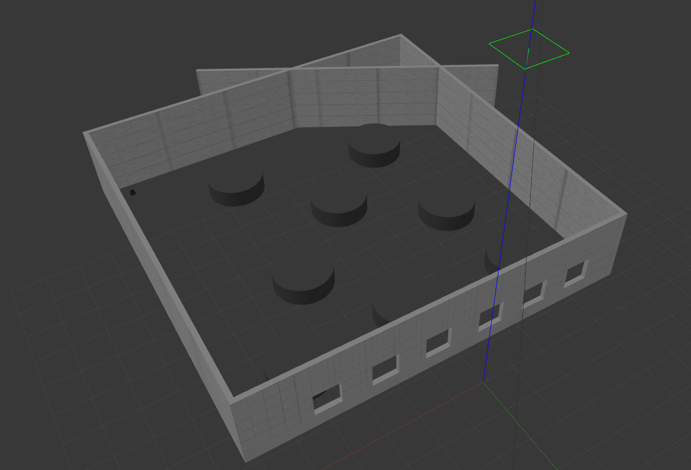
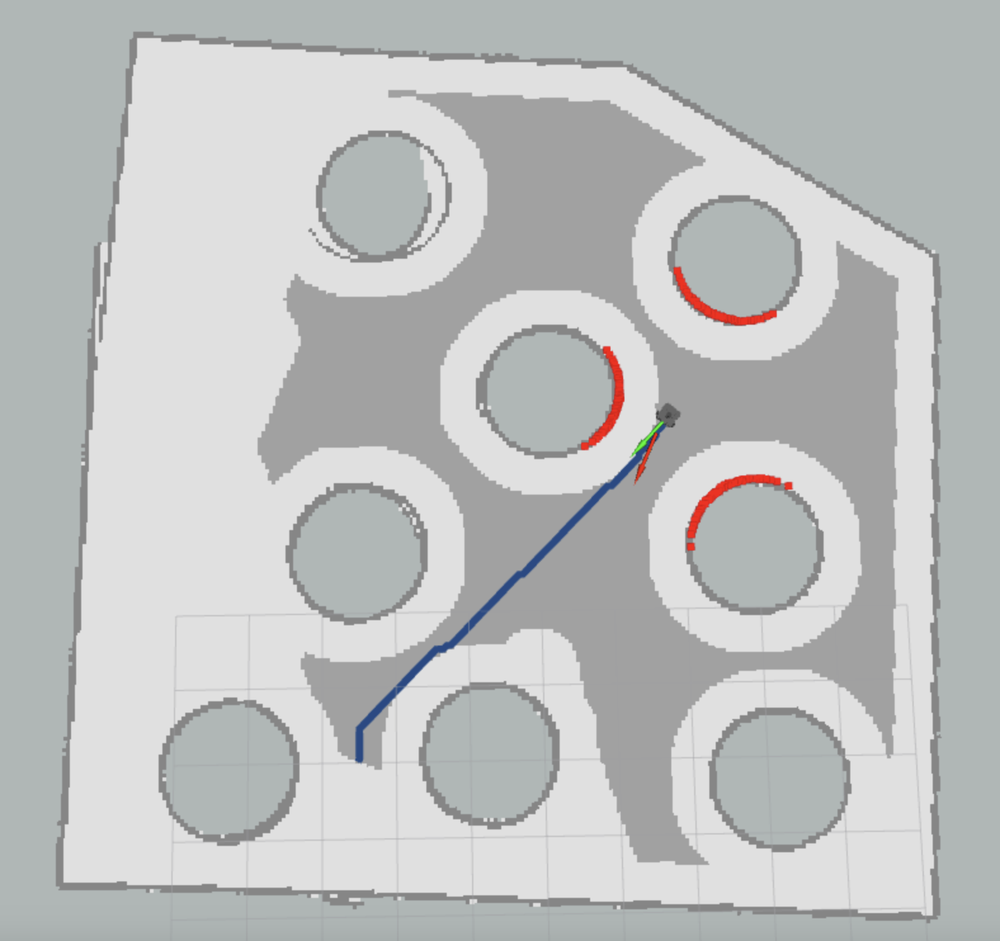

<p align="center">
  
</p>

<p align="center">
    
    
</p>

# ROS Motion Planning

**Robot Motion planning** is a computational problem that involves finding a sequence of valid configurations to move the robot from the source to the destination. Generally, it includes **Path Searching** and **Trajectory Optimization**.

* **Path Searching**: Based on path constraints, such as obstacles, to find the optimal sequence for the robot to travel from the source to the destination without any collisions.

* **Trajectory Planning**: Based on kinematics, dynamics and obstacles, it optimizes the trajectory of the motion state  from the source to the destination according to the path.

This repository provides the implementation of common **Motion Planning** algorithms. The theory analysis can be found at [motion-planning](https://blog.csdn.net/frigidwinter/category_11410243.html). Furthermore, we provide [Python](https://github.com/ai-winter/python_motion_planning) and [MATLAB](https://github.com/ai-winter/matlab_motion_planning) version.

**This fork add a custom world and launch file for the 302's 3IL room**

|  |  |
|:------------------------------------------:|:--------------------------------------:|

## Contents
- [Quick Start within 3 Minutes](#0)
- [Document](#1)
- [Version](#2)
- [License](#3)

## <span id="0">0. Quick Start within 3 Minutes

*Tested on ubuntu 20.04 LTS with ROS Noetic.*

1. Install [ROS](http://wiki.ros.org/ROS/Installation) (Desktop-Full *suggested*).

2. Install git.
    ```bash
    sudo apt install git
    ```

3. Install dependence

    - OSQP
    ```bash
    git clone -b release-0.6.3 --recursive https://github.com/oxfordcontrol/osqp
    cd osqp && mkdir build && cd build
    cmake .. -DBUILD_SHARED_LIBS=ON
    make -j6
    sudo make install
    sudo cp /usr/local/include/osqp/* /usr/local/include
    ```

    - OSQP-Eigen

    ```bash
    git clone https://github.com/robotology/osqp-eigen.git
    cd osqp-eigen && mkdir build && cd build
    cmake ..
    make
    sudo make install
    ```

    - Other dependence.
    ```bash
    sudo apt install python-is-python3 \
    ros-noetic-amcl \
    ros-noetic-base-local-planner \
    ros-noetic-map-server \
    ros-noetic-move-base \
    ros-noetic-navfn
    ```

4. Clone the reposity.
    ```bash
    git clone https://github.com/ai-winter/ros_motion_planning.git
    ```

5. Compile the code.

   **NOTE: Please refer to [#48](https://github.com/ai-winter/ros_motion_planning/issues/48) if you meet libignition dependency error.**
    ```bash
    cd ros_motion_planning/
    catkin_make
    # or catkin build
    # you may need to install it by: sudo apt install python-catkin-tools
    ```

6. Import the world and the launch file

7. Launch the world
    ```bash
    export TURTLEBOT3_MODEL=burger 
    roslaunch turtlebot3_gazebo turtlebot3_world.launch 
    ```

8. Execute the code.
    ```bash
    cd scripts/
    ./main.sh
    ```

    > NOTE: Modifying launch files may not have any effect, because they are regenerated by a Python script based on `src/user_config/user_config.yaml` when you run `main.sh`. Therefore, you should modify configurations in `user_config.yaml` instead of launch files.

9. Use **2D Nav Goal** in RViz to select the goal.

10.  Moving!

11.  You can use the other script to shutdown them rapidly.
    ```bash
    ./killpro.sh
    ```

## <span id="1">1. Document

The overall file structure is shown below.

```
ros_motion_planner
├── assets
├── launch                  # launch file for the custom world (302)
├── scripts
├── worlds                  # worlds to import (302)
└── src
    ├── core
    │   ├── global_planner
    │   ├── local_planner
    │   ├── curve_generation
    │   └── utils
    ├── sim_env             # simulation environment
    │   ├── config
    │   ├── launch
    │   ├── maps
    │   ├── meshes
    │   ├── models
    │   ├── rviz
    │   ├── urdf
    │   └── worlds
    ├── third_party
    │   ├── dynamic_rviz_config
    │   ├── dynamic_xml_config
    │   ├── gazebo_plugins
    │   └── rviz_plugins
    └── user_config         # user configure file
```

## <span id="2">2. Version

### Global Planner

|     Planner      |                                                                                            Version                                                                                            |                         Animation                          | Papers
|:----------------:|:---------------------------------------------------------------------------------------------------------------------------------------------------------------------------------------------:|:----------------------------------------------------------:|:---------:|
|   **Dijkstra**   |      [](https://github.com/ai-winter/ros_motion_planning/blob/master/src/core/global_planner/graph_planner/src/a_star.cpp)       |                |-
|     **A\***      |      [](https://github.com/ai-winter/ros_motion_planning/blob/master/src/core/global_planner/graph_planner/src/a_star.cpp)       |                    |[A Formal Basis for the heuristic Determination of Minimum Cost Paths](https://ieeexplore.ieee.org/document/4082128)
|     **RRT**      |       [](https://github.com/ai-winter/ros_motion_planning/blob/master/src/core/global_planner/sample_planner/src/rrt.cpp)        |                          |[Rapidly-Exploring Random Trees: A New Tool for Path Planning](http://msl.cs.uiuc.edu/~lavalle/papers/Lav98c.pdf)

## <span id="3">3. License

The source code is released under [GPLv3](https://www.gnu.org/licenses/) license.
